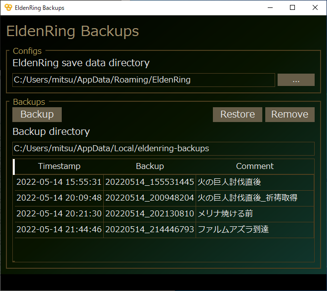

EldenRing Backups
=================

The EldenRing save data backup manager written by Qt 5.




### Features
- Quick backup / restore.
- Backup with comment.
- That's all :)


### Build
#### Dependencies
- Qt 5.x (LGPL version)
- C++17 Compiler
  - Windows: Visual Studio 2022
  - Linux: Clang 7.x


#### Clone this repository
```
git clone git@github.com:mitsu-ksgr/eldenring-backups.git
```


#### Windows
- use developer powershell

```powershell
> cd eldenring-backups
> mkdir build
> cd build
> qmake ../
> nmake
```


#### Linux (for development)
```sh
$ cd eldenring-backups
$ mkdir build
$ cd build
$ qmake ../
$ make
```


### Thanks
- Icon from [いらすとや](https://www.irasutoya.com/)


